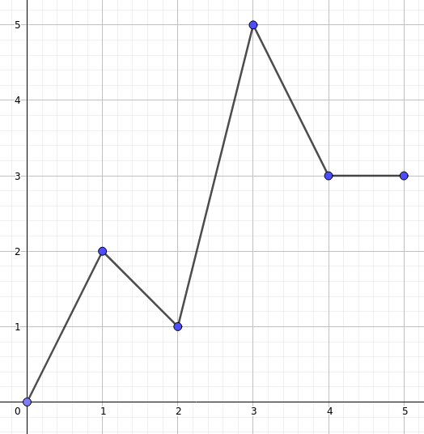

# Goal

Since  the  various  revelations  about  the  NSA,  you  no  longer  trust  the  random  number generator of your operating system. So you have set up the following countermeasure:

after  drawing  a  random  integer,  you  pass  it  to  a  mysterious  homemade  (deterministic) function, which associates any integer between 0 and N another integer between 0 and N.

Your hierarchy has been so seduced by the simplicity of this idea that it has asked you to extend this mysterious function to decimals. For this, you make a linear interpolation on each interval [i, i + 1] (see example below for an explanation).

However,  you  begin  to  doubt:

The  numbers  near  the  middle  of  the  interval  [0, N] appear more often than
those at the ends? This would be an unfortunate defect for your random generation. That's why you want to determine the number of times the function goes through N / 2.

The graph above represents the interpolated function from the values:
f (0) = 0, f (1) = 2, f (2) = 1, f (3) = 5, f (4) = 3, f (5) = 3

For example, between 2 and 3, f takes all the values from 1 to 5, each one time. So, there is an x between 2 and 3 such that f (x) = 2.5.

We also see that the function takes the value 1.5 three times:
  - between 0 and 1 since f (0) < 1.5 < f (1);
  - between 1 and 2 since f (1) > 1.5 > f (2);
  - then between 2 and 3 since f (2) < 1.5 < f (3)

Moreover, it takes the value 2 twice (once exactly in 1, since f (1) = 2, and again at a certain point between 2 and 3, since f (2) < 2 < f (3)), and the value 3 an infinity of times (indeed, any entry between 4 and 5 will give an output equal to 3, and there is an infinity of real numbers between 4 and 5.).

### Input

Row 1: an integer N between 1 and 99.

Row 2: N + 1 integers (not N, beware!) separated by spaces, indicating f (0), f (1), ..., f (N) (f being your function), all are between 0 and N included.

### output

An integer indicating the number of different x values between 0 and N for which f (x) is N / 2.

If this number is infinite, output INF.

### Examples

The input corresponding to the example given above is the following:

    5
    0 2 1 5 3 3

The expected output is 1, in fact there is exactly one x for which f (x) = 5/2 = 2.5, as
mentioned above this x is between 2 and 3

On the following entry:

    4
    0 2 2 1 0

The expected output is INF.
